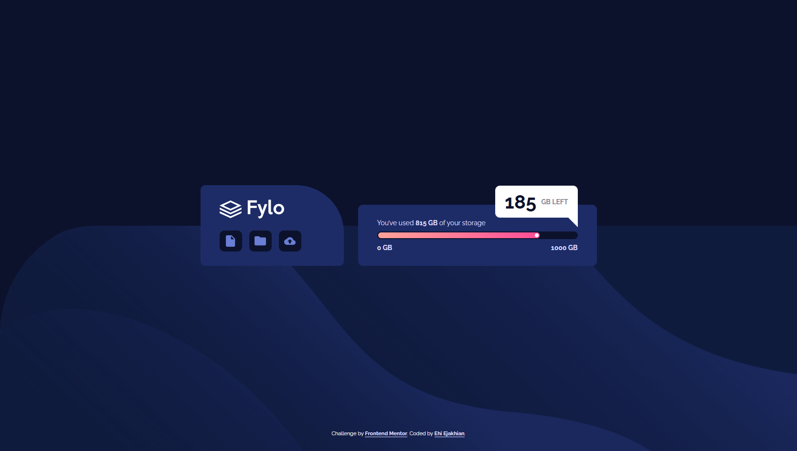

# Frontend Mentor - Fylo data storage component solution

This is a solution to the [Fylo data storage component challenge on Frontend Mentor](https://www.frontendmentor.io/challenges/fylo-data-storage-component-1dZPRbV5n). Frontend Mentor challenges help you improve your coding skills by building realistic projects. 

## Table of contents
- [Me](#meet-me)
- [Screenshot](#screenshot)
- [My process](#my-process)
  - [Built with](#built-with)
  - [What I learned](#what-i-learned)
  - [Continued development](#continued-development)
  - [Useful Resources](#useful-resources)
- [Author](#author)
- [Thanks](#thanks)


## Meet Me
Good day. I'm Ehi. I'm an aspiring developer from Edo, Nigeria. I took this challenge. Here's how I did it and thanks for reading!

## Screenshot

The Challenge

My Desktop design

## My process
After my HTML, I start styling with padding. I set the margin of all elements to zero and then give all elements borders. This helps me visualize all element boundaries - all this I do without adding any color.

Then, I add color, backgrounds and border radii to the assigned elements. I prefer using Comic Sans MS or Comic Relief as my font during design because it feels relaxing to my eyes and it helps me think better. I can't explain it though, it's just a feeling.

Funny and weird, right?😁

With SASS, I create mixins and partials to modularize my code. It helps me think and scroll through code with a simple mind.


### Built with

- Semantic HTML5 markup
- CSS custom properties
- Flexbox
- SCSS
- Mobile-first workflow

### What I learned
I learned how to create tooltips for the first time. Using SCSS:


```scss
@media (min-width: $tablet) {
  border-bottom-right-radius: 0;
  position: absolute;
  top: -40px;
  align-self: flex-end;

  &::after {
    content: '';
    position: absolute;
    border: 10px solid #fff;
    top: 100%;
    right: 0;
    background-color: #fff;
    border-color: #fff #fff $Blue-850 $Blue-850;
  }
}
```

### Continued development

I had problems with scaling to meet the design. The font size, padding and widths didn't just add up for me. I would love to getv better at that and I would appreciate any help on that.

### Useful Resources

- [W3 school Tutorial | Tooltips](https://www.w3schools.com/css/css_tooltip.asp) - This helped me create the tooltip. W3 schools is an amazing platform that teaches you everything.

## Author
For now I don't have a website of my own, but I am working on having one soon. It's very important.
- Frontend Mentor - [@EhiEjakhian](https://www.frontendmentor.io/profile/EhiEjakhian)
- Chat me on Whatsapp - [Ehi Ejakhian](https://wa.me/+2348142340182?text=Hello%20Ehi%20.%20I%20checked%20your%20Fylo%20data%20storage%20component%20solution!)
- LinkedIn - [Ejakhian Ehi](https://ng.linkedin.com/in/ehi-ejakhian-2302a7318)

I'm also an aspiring comic and sketch artist, so if you have any gigs or if you can relate, check me up on whatsapp and see my art.

# Thanks!
Thank you for going through this. I really hope I did good to your taste, if not please tell me how to improve on the comments section of my solution. Thanks again!
